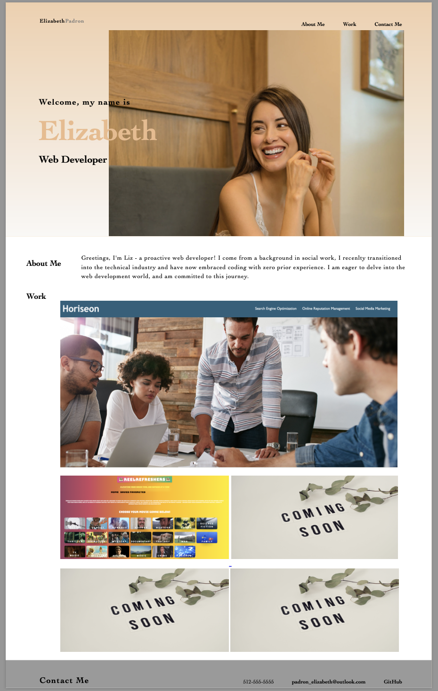

# ElizabethPortfolio

This web page will compile all of the work I complete throughout the coding course. I want this portfolio to showcase my skills and talents; therefore, I will continue to make improvements and additions. 

For this initial submission the following was completed:
I created this initial code from scratch.
I added my name and a recent photograph of myself. 
I created navigation links, which navigate to the designated sections on the web page, modifications will be made to this. 
I added an image of the first application I completed during this course.
After clicking on the image, the user is taken to the deployed application. 
Code was added to make this site a responsive layout that adapts to the user viewport. 

 